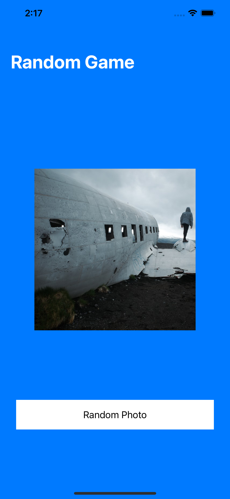

# Random Photo

This is my first app to learn how to create apps using swift language.

## What does the app do?

Every time you press the button to randomize a photo,
a new photo and a random background color are shown.

    
    
    

